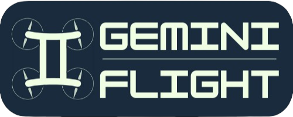

# GeminiFlight
Open Source Flight Stack optimised for low cost and high customisability

## Why GeminiFlight? Why reinvent the wheel? 
TLDR, It's a better wheel. 
I refuse to pay 20k INR to buy an "obsolete" flight controller and 1.3L INR for something they consider to be latest. As a business I don't want to invest in an ecosystem that's steering away from making drone technology easy to use and accessible to a cost sensitive market like India. While it's fair for the Pixhawk and Ardupilot ecosystem to push the envelope further by adding more and more features, it makes their hardware extremely expensive to use and their firmware very difficult to understand and make changes to, hence increasing the barrier to entry for newcomers and hobbyists.

GeminiFlight consists of a flight stabilisation unit (the firmware) paired with an autopilot unit (the host). The goal is to have a simple configurable firmware, with complex high level general purpose software control. This distinction helps offload computationally expensive tasks to a microprocessor that's better suited to handle them and only keeping hard real-time tasks on the microcontroller. This reduces both costs and complexity. It also also opens up the platform for use in both manual recreational drones and autonomous enterprise drones. This dual-brain architecture was greatly inspired by the harmonious duality of the [Neocortex](https://en.wikipedia.org/wiki/Neocortex) and the [Limbic System](https://en.wikipedia.org/wiki/Limbic_system) in the human brain and is also where GeminiFlight gets it's name from.

The core belief is that simplicity is the ultimate sophestication. That performance does not come from the speed of the programming language itself but from being able to develop and iterate on more efficient algorithms and architectures. GeminiFlight will continue using Arduino and Node-Red in it's stack in the forseeable future. We will not accept any PRs that prioritize performance at the cost of readability, maintainability or hackability.

## How to get started?

Flash Raspberry Pi OS Lite Legacy 32-Bit on the Raspberry Pi

Install Git
```
sudo apt update && sudo apt install git
```

GeminiFlight uses a git submodule structure to organise it's code.
```
git clone --recurse-submodules https://github.com/Udan-Khatola/GeminiFlight.git 
```

Install Node-Red and NodeJS
```
bash <(curl -sL https://raw.githubusercontent.com/node-red/linux-installers/master/deb/update-nodejs-and-nodered)
```

Open the folder in [VSCode](https://code.visualstudio.com/) & install any extensions you get prompted for.
Open individual submodule folders for further setup instructions .
